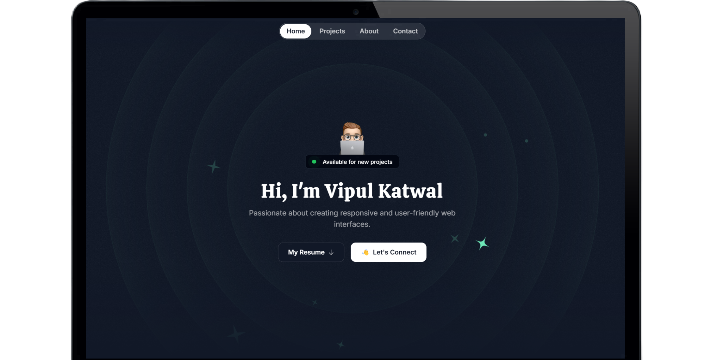

# 🚀 My Personal Portfolio



## 🌟 Overview

Welcome to my personal portfolio! This project showcases my skills, projects, and experiences as a web developer. Built with modern technologies, it's designed to be fast, responsive, and visually appealing.

## 🛠️ Technologies Used

- **Next.js** - React framework for server-side rendering and static site generation
- **React** - JavaScript library for building user interfaces
- **TailwindCSS** - Utility-first CSS framework for rapid UI development
- **Framer Motion** - Animation library for React
- **Web API Forms** - For handling form submissions

## ✨ Features

- 🏠 Responsive home page
- 👨‍💻 Project showcase
- 📬 Contact form
- 🎨 Smooth animations and transitions

## 🚀 Getting Started

To run this project locally:

1. Clone the repository
   ```
   git clone https://github.com/vipulkatwal/vipulkatwal-portfolio.git
   ```

2. Install dependencies
   ```
   cd vipulkatwal-portfolio
   npm install
   ```

3. Run the development server
   ```
   npm run dev
   ```

4. Open [http://localhost:3000](http://localhost:3000) in your browser

## 📁 Project Structure

```
my-portfolio/
├── node_modules/
├── public/
│   ├── favicon.png
│   ├── next.svg
│   └── vercel.svg
├── src/
│   ├── app/
│   │   ├── globals.css
│   │   ├── layout.tsx
│   │   └── page.tsx
│   ├── assets/
│   │   ├── icons/
│   │   └── images/
│   ├── components/
│   │   └── sections/
│   │       ├── About.tsx
│   │       ├── Contact.tsx
│   │       ├── Footer.tsx
│   │       ├── Header.tsx
│   │       ├── Hero.tsx
│   │       ├── Projects.tsx
│   │       └── Tape.tsx
├── .env
├── .eslintrc.json
├── .gitignore
├── next-env.d.ts
├── next.config.mjs
├── package.json
├── package-lock.json
├── tsconfig.json
```

## 🤝 Contributing

While this is a personal portfolio, I'm open to suggestions and improvements! Feel free to open an issue or submit a pull request.

## 📄 Live Link

This project is open source and available under the [Live Link](https://vipulkatwal.vercel.app).

## 📞 Contact

Feel free to reach out to me for any questions or collaborations!

- Email: vipulkatwal17@gmail.com
- LinkedIn: [Vipul Katwal](https://www.linkedin.com/in/vipulkatwal)

---

⭐️ Don't forget to star this repo if you found it helpful! ⭐️